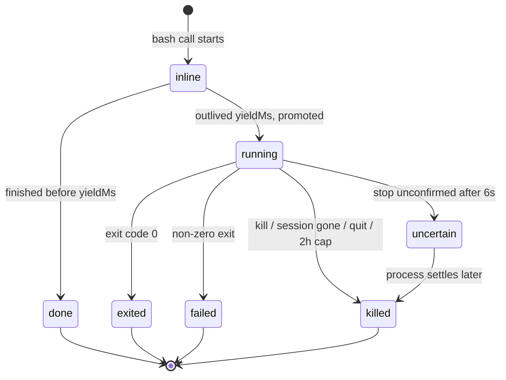

# Background processes

A `bash` command that outlives its wait is **no longer killed**. It keeps running, the tool call returns a process id, and the agent follows it with three new shell commands. This doc maps what that changes, who owns a running process, and what ends one.

The design argument and the rejected alternatives are in the [plan](../plans/active/background-shell-processes.md). This is the map of the code as it stands.

## The one rule

```
bash(command, yieldMs = 30s)
        │
        ├── finishes within yieldMs ──────────►  exit code + output      (unchanged)
        │
        └── still running at yieldMs
                 │
                 ├── promote fails (cap, closing session, log) ──► run stopped, error text
                 │
                 └── promoted ──►  bg_1 + output so far + a log file path
                                        │
                                        └── agent uses `jobs` / `fg` / `kill`
```

`&`, `nohup` and `disown` are **not** how something goes to the background. They are unsupported, and outliving `yieldMs` is the only route. That is stated in the tool description at [`create-bash-env.ts:378`](../../packages/workspace/src/lib/create-bash-env.ts#L378).

## What the model sees change

| | Before | After |
|---|---|---|
| Wait parameter | `timeoutMs` — expiry kills the command | `yieldMs` — expiry hands it off |
| Tools | `bash` | `bash` (no new tools) |
| Commands | — | `jobs`, `fg`, `kill` |
| `bash` output | `exitCode`, `output` | adds `processId`, `logFilePath`, `omittedBytes`, `logOmittedBytes`, `logWriteError`; `exitCode` becomes optional |

Management is **commands, not tools**, which buys two things a tool could not:

- **Composition.** `fg bg_1 | rg error` filters before the output is paid for in context. `fg bg_1 && pnpm test` works because `fg` exits with the process's own code.
- **No replay lie.** A tool result is re-rendered by `toModelOutput` every turn, so a tool that said "bg_1 running 5s" would keep saying it forever. Command stdout is captured once, so a `jobs` listing is frozen at the moment it ran.

## Lifecycle



`uncertain` is the honest state: the stop was issued, the tree did not confirm. If the process settles afterward, its **real exit code and last output are taken then** ([`background-processes.ts` `finish`](../../packages/workspace/src/lib/background-processes.ts)) rather than discarded.

## Where the code lives

```
tools/bash.ts ─────────────────────── starts the run, races yieldMs, promotes
        │                                       (packages/workspace/src/tools/bash.ts)
        ▼
lib/background-processes.ts ───────── the registry: ids, records, caps, reads, kills
        │   ├── background-output-buffer.ts   256 KB of pending output per process
        │   ├── bounded-log-writer.ts         16 MB log at work/.tool-output/bg_N.log
        │   ├── bounded-text.ts               head+tail bound on one read
        │   └── chunk-window.ts               eviction shared by the two buffers
        ▼
lib/shell-commands/output-sink.ts ─── AsyncLocalStorage sink; every chunk is
        │                              redacted here, before model and log
        ▼
lib/shell-commands/exec-shim.ts ───── spawns the real binary (detached on POSIX)
        │
        ▼
lib/subprocess-tree.ts ───────────── kills the whole tree, confirms it is gone
```

The agent-facing surface is one file: [`lib/shell-commands/background-jobs.ts`](../../packages/workspace/src/lib/shell-commands/background-jobs.ts), which defines `jobs`, `fg` and `kill` and is wired into the sandbox by `SESSION_COMMAND_DEFS` in [`create-bash-env.ts`](../../packages/workspace/src/lib/create-bash-env.ts).

## Ownership and what ends a process

The registry is keyed by **session**, not task ([`recordsBySession`](../../packages/workspace/src/lib/background-processes.ts)). One task can have several live sessions — parallel turns, and every subagent gets its own session id from `spawnAgent` — so a task-keyed registry would let one session read and kill another's work.

| Trigger | Reaches | Where |
|---|---|---|
| `kill bg_1` | one process | [`background-jobs.ts`](../../packages/workspace/src/lib/shell-commands/background-jobs.ts) |
| Session removed | that session's processes | [`rpc/routes/session.ts:110`](../../packages/workspace/src/rpc/routes/session.ts#L110) |
| Task trashed | the whole task's processes | [`lib/trash-task.ts:47`](../../packages/workspace/src/lib/trash-task.ts#L47) |
| App quits | everything | [`create-workspace-actor.ts:362`](../../apps/studio/src/electron-main/lib/create-workspace-actor.ts#L362) |
| 2 hours old | that process | `ageTimer` in `promoteBackgroundProcess` |
| **Turn ends** | **nothing — deliberate** | — |

**The gaps this leaves**, in plain terms:

- A subagent session that simply *finishes* is not "removed", so its processes live until quit or the 2-hour cap.
- The 2-hour cap is **absolute age, not idle time**. A dev server the user is actively using dies at two hours. The browser subsystem solved the same problem with idle-based reaping; this has not been changed to match.
- Nothing survives an app restart, and nothing tries to. A record describes a live child process; after a restart there is no process to describe.

## Caps

| Bound | Value | Why |
|---|---|---|
| Running per task | 8 | Refusing the ninth names the eight that are live |
| Pending output per process | 256 KB | Held in memory between reads |
| Process log | 16 MB | On disk at `work/.tool-output/bg_N.log` |
| One `fg` wait | the call's remaining `yieldMs`, 10 min ceiling | A wait that outlived its call would promote the call itself, answering with a second id instead of output. An explicit `--timeout` can only lower it |
| `yieldMs` | 250 ms – 10 min, default 30 s | Tool-call timeout is `yieldMs + 30 s` so promotion always wins |
| Kill escalation | SIGTERM → 1 s → SIGKILL → 4 s | Then `uncertain` |
| Finished records kept | 32 per session | A late poll still finds its exit code |

## Two Unix metaphors we sit on

- **`kill`** normally takes a pid. Ours takes `bg_1` or `%1` and **refuses a bare number**, so there is no route from the sandbox to the host's own processes.
- **`wait`** is a `just-bash` interpreter builtin that no custom command can shadow, and it exits **0 with empty output** — which reads as "the process finished and wrote nothing", the one wrong answer here that looks right. A transform in `create-bash-env.ts` rewrites `wait` to `fg` in the AST so the agent's strongest prior cannot produce it.

## What the user sees

**A pill beside the task title**, absent whenever nothing is running — [`task-background-processes.tsx`](../../apps/studio/src/client/components/task/task-background-processes.tsx). It says "2 running" rather than showing a bare count, because an unread badge is a number in a dot and this in that shape beside a title would be read as one. Clicking it opens a popover with the explanation, each command, how long it has been going, and a stop.

The word "process" appears nowhere in it. The audience did not ask for a server and does not know they have one, so every string says *still running*. The placements that were considered and why this one won are in [wireframes-background-processes.html](../plans/active/wireframes-background-processes.html).

One other renderer change: a promoted command has no exit code yet, and treating a missing code as non-zero painted every still-running command as a failure — fixed in [`bash-exit-status.ts`](../../apps/studio/src/client/components/message-part/bash-exit-status.ts).

**What is still missing:** nothing warns the user when the two-hour cap fires, so a server stopping on its own reads as a bug. And the sidebar shows nothing, so a task you are not looking at can hold a running process invisibly.

## Does ordinary `bash` behave worse?

The honest list of what changed for a command that never gets promoted:

- **Every** run now allocates an output buffer and a start timestamp, because any run may be promoted. One extra clock read; no I/O until promotion.
- **Every** streamed chunk passes through redaction at the sink rather than only the final output being filtered. The redaction is bounded to stay linear in line length.
- On POSIX, shims spawn `detached` so a kill can reach the whole process group. This does **not** create crash-orphans that did not exist before: descendants already survived a parent SIGKILL either way, and execa's own cleanup only ever killed the direct child.
- `pnpm dev` and `pnpm start` are **no longer refused**. They were refused only because nothing could host a long-running command; now something can.
