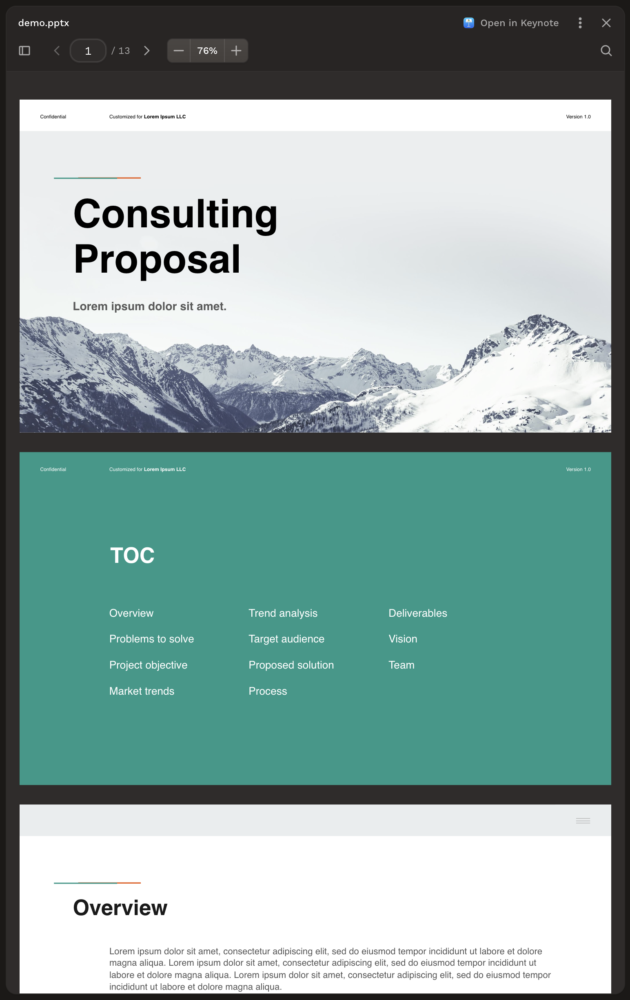
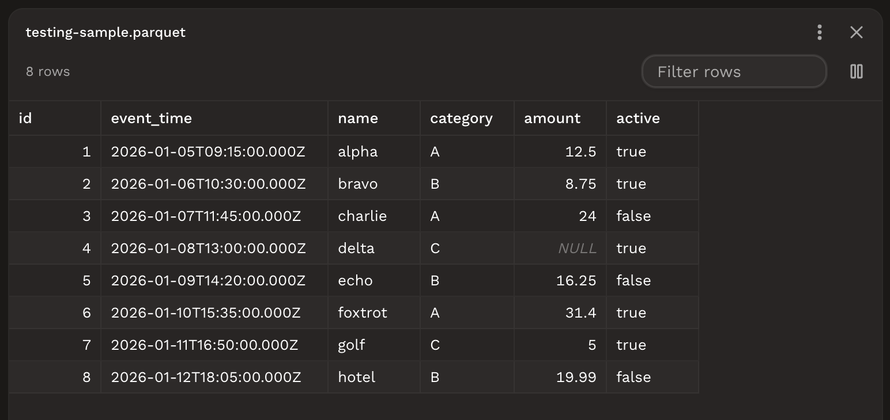
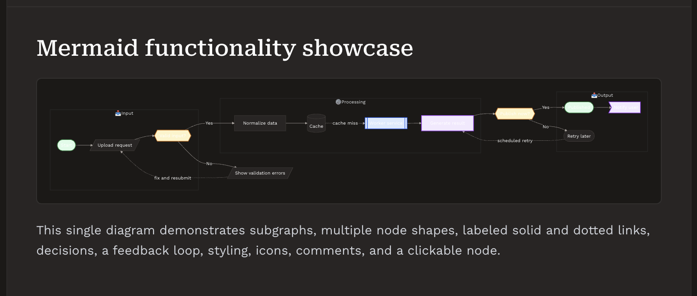
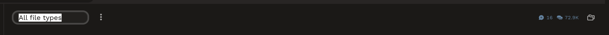
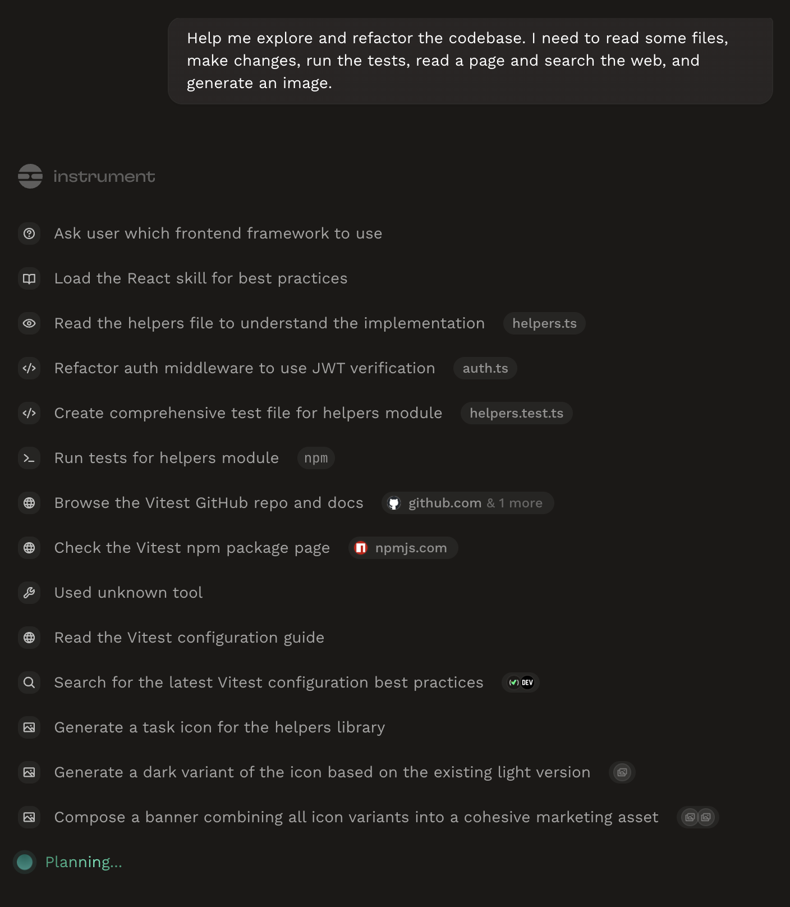
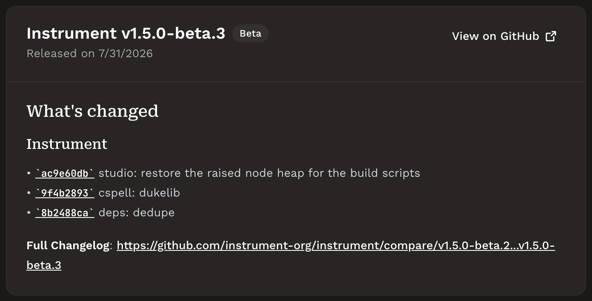

# v1.5 beta changes

Range: `v1.4.4..v1.5.0-beta.4`, covering `v1.5.0-beta.1` through `v1.5.0-beta.4`.

These are review-worthy product surfaces rather than a chronological changelog. Commits authored by or co-authored with Neil Renicker are excluded. Screenshots were captured from the `v1.5.0-beta.4` checkout.

- **Paged document viewers**

  Location: Studio task page, file viewer.

  PDF, DOCX, and PPTX files now open in read-only viewers with page or slide navigation, zoom, fit-width, find, and thumbnail controls.

  Source changes: [344491300](https://github.com/instrument-org/instrument/commit/344491300), [d0c6dd391](https://github.com/instrument-org/instrument/commit/d0c6dd391), [d81f00cc8](https://github.com/instrument-org/instrument/commit/d81f00cc8), [2428acb91](https://github.com/instrument-org/instrument/commit/2428acb91)

  Screenshot:

  

  ```text
  Use these commits as repo context for paged document viewers: 344491300 d0c6dd391 d81f00cc8 2428acb91

  Location: Studio task page, file viewer.
  ```

- **Data and archive viewers**

  Location: Studio task page, file viewer.

  SQLite, ZIP, iWork, Parquet, and JSONL files now have dedicated previews, with tabular formats sharing a virtualized grid for filtering, sorting, selection, copying, resizing, and column visibility.

  Source changes: [9659bc76e](https://github.com/instrument-org/instrument/commit/9659bc76e)

  Screenshot:

  

  ```text
  Use this commit as repo context for data and archive viewers: 9659bc76e

  Location: Studio task page, file viewer.
  ```

- **Rendered Mermaid diagrams**

  Location: Studio task page, transcript and Markdown file viewer.

  Mermaid code fences now render as theme-aware diagrams across Markdown surfaces, retain source and copy controls, support links, and open into a navigable full-window preview.

  Source changes: [14e243e67](https://github.com/instrument-org/instrument/commit/14e243e67), [f910e3cfa](https://github.com/instrument-org/instrument/commit/f910e3cfa), [bedb79b33](https://github.com/instrument-org/instrument/commit/bedb79b33), [fa4221279](https://github.com/instrument-org/instrument/commit/fa4221279)

  Screenshot:

  

  ```text
  Use these commits as repo context for rendered Mermaid diagrams: 14e243e67 f910e3cfa bedb79b33 fa4221279

  Location: Studio task page, transcript and Markdown file viewer.
  ```

- **Simplified task header**

  Location: Studio task page, header.

  The task header now centers on the title and overflow menu, moves files into a right-side popover, and turns the title into a one-click inline rename field.

  Source changes: [5f262ca83](https://github.com/instrument-org/instrument/commit/5f262ca83), [84b185a7e](https://github.com/instrument-org/instrument/commit/84b185a7e), [e3c67e0a1](https://github.com/instrument-org/instrument/commit/e3c67e0a1)

  Screenshot:

  

  ```text
  Use these commits as repo context for the simplified task header: 5f262ca83 84b185a7e e3c67e0a1

  Location: Studio task page, header.
  ```

- **Readable transcript run rows**

  Location: Studio task page, transcript.

  Planning, reasoning, and tool calls now share compact inline run rows with manual expansion, stable heights, state-aware durations, and a brand-tinted active state.

  Source changes: [2a5a3a673](https://github.com/instrument-org/instrument/commit/2a5a3a673), [e503d1286](https://github.com/instrument-org/instrument/commit/e503d1286), [69d1f8f11](https://github.com/instrument-org/instrument/commit/69d1f8f11), [1c0fbd0b0](https://github.com/instrument-org/instrument/commit/1c0fbd0b0)

  Screenshot:

  

  ```text
  Use these commits as repo context for readable transcript run rows: 2a5a3a673 e503d1286 69d1f8f11 1c0fbd0b0

  Location: Studio task page, transcript.
  ```

- **Visible beta release notes**

  Location: Release notes page.

  Prerelease and development builds now include published beta release notes, exposing each beta's commit list and comparison link inside Studio.

  Source changes: [7b4029beb](https://github.com/instrument-org/instrument/commit/7b4029beb)

  Screenshot:

  

  ```text
  Use this commit as repo context for visible beta release notes: 7b4029beb

  Location: Release notes page.
  ```
