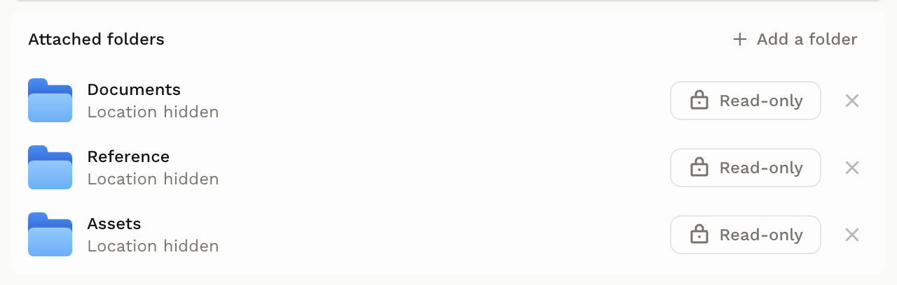
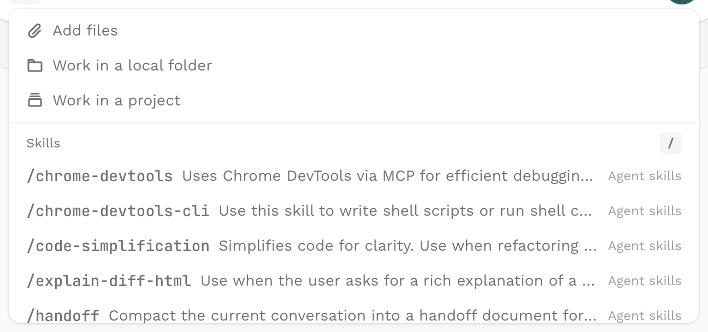
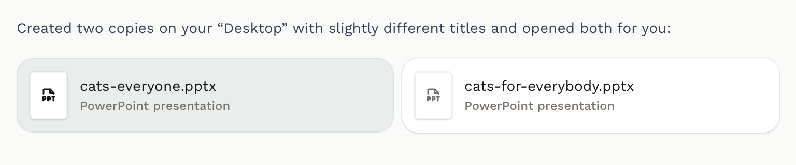
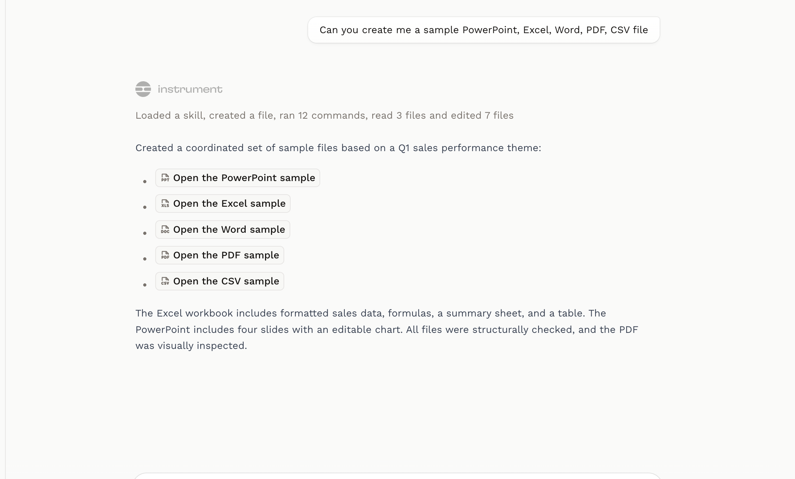
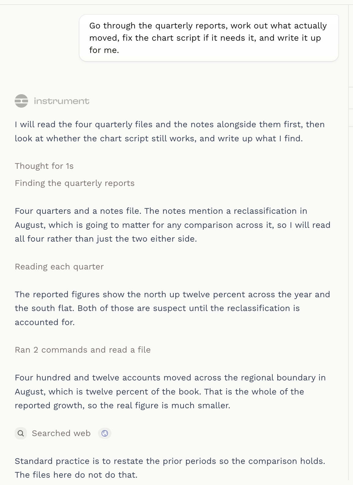
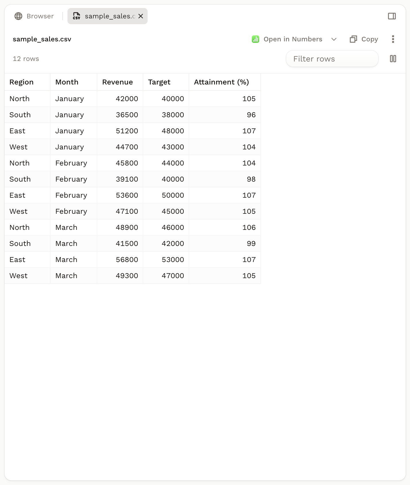
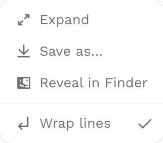
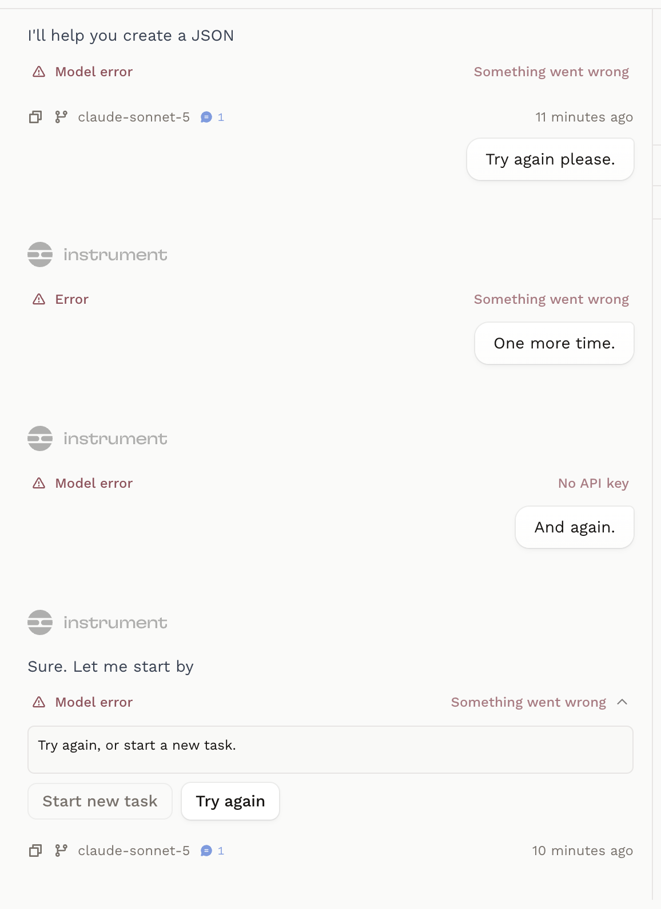

# v1.6 beta changes

Range: `v1.5.0..v1.6.0-beta.4`, covering `v1.6.0-beta.0` through `v1.6.0-beta.4`.

These are review-worthy product surfaces rather than a chronological changelog. Commits authored by or co-authored with Neil Renicker are excluded, as are developer-mode-only surfaces. Screenshots were captured from the installed production macOS build at `v1.6.0-beta.4` (`01fa65b725ba3bae30efd4a08840753437ea017a`), except grouped transcript activity, which was captured from the debug transcript fixture. That fixture renders the shipping component against scripted data, so the layout is the product's and the words in it are not a real turn's.

- **Writable folder access**

  Location: Project details and the new-task composer.

  Local folders can now be shared read-only or with full access, with the chosen permission shown directly on each folder row and enforced by the workspace mount.

  Source changes: [f381e4beb](https://github.com/instrument-org/instrument/commit/f381e4beb), [78ae3c0d0](https://github.com/instrument-org/instrument/commit/78ae3c0d0), [096e533f8](https://github.com/instrument-org/instrument/commit/096e533f8)

  Screenshot:

  

  Folder names and locations were replaced with generic labels before capture; the component layout and controls are unchanged. Every row pictured is set to Read-only, so the full-access state this change introduces is not shown.

  ```text
  Use these commits as repo context for writable folder access: f381e4beb 78ae3c0d0 096e533f8

  Location: Project details and the new-task composer.
  ```

- **Composer Add menu**

  Location: New-task and task composers.

  Files, local folders, projects, and skills now share one Add menu behind the composer plus button, with project selection and long skill lists handled inside the same bounded surface.

  Source changes: [e05b69f4f](https://github.com/instrument-org/instrument/commit/e05b69f4f), [f8fd847be](https://github.com/instrument-org/instrument/commit/f8fd847be), [cc7e6a082](https://github.com/instrument-org/instrument/commit/cc7e6a082)

  Screenshot:

  

  ```text
  Use these commits as repo context for the composer Add menu: e05b69f4f f8fd847be cc7e6a082

  Location: New-task and task composers.
  ```

- **Agent file handoff**

  Location: Studio task transcript.

  Files named by an agent now render as type-aware, clickable file controls. A ` ```files ` fence draws them as a grid, a path written as a Markdown link resolves to a single chip, and a task from before the fence gets a grid built from what its turns produced.

  Source changes: [9b07f7e7c](https://github.com/instrument-org/instrument/commit/9b07f7e7c), [9161b9eaf](https://github.com/instrument-org/instrument/commit/9161b9eaf), [17ada1c24](https://github.com/instrument-org/instrument/commit/17ada1c24), [a2fd717c2](https://github.com/instrument-org/instrument/commit/a2fd717c2)

  Screenshots, one per rendering:

  

  A reply whose fence names two files. Both are the same kind, so the type-aware label is shown but not contrasted. The first card is brand-colored with the pane closed, which is a defect in this build rather than a state to review: the pane keeps its selection through a close so reopening restores the tab, and the grid read that key as what the user is looking at. Fixed after this range in [fa6090dcc](https://github.com/instrument-org/instrument/commit/fa6090dcc).

  

  The chip path, and the one shape a current task will not produce. This task predates the fence, so its reply links each file in Markdown; the compatibility grid skips any file the reply already linked, so it is suppressed here for all five.

  ```text
  Use these commits as repo context for agent file handoff: 9b07f7e7c 9161b9eaf 17ada1c24 a2fd717c2

  Location: Studio task transcript.
  ```

- **Grouped transcript activity**

  Location: Studio task transcript.

  Consecutive tool calls now fold under purpose-based activity rows, while prose ends the current phase and the Instrument wordmark and working row establish a stable start for each turn.

  Source changes: [08acfdc9c](https://github.com/instrument-org/instrument/commit/08acfdc9c), [9706e51a2](https://github.com/instrument-org/instrument/commit/9706e51a2), [5207402bb](https://github.com/instrument-org/instrument/commit/5207402bb), [cbfd055a4](https://github.com/instrument-org/instrument/commit/cbfd055a4)

  Screenshot:

  

  ```text
  Use these commits as repo context for grouped transcript activity: 08acfdc9c 9706e51a2 5207402bb cbfd055a4

  Location: Studio task transcript.
  ```

- **Tabbed task pane**

  Location: Right side of a Studio task.

  The task's browser and open files now live in one tabbed pane with a fixed Browser tab, closable and reorderable file tabs, and compression when the strip runs out of room.

  Source changes: [855a9645e](https://github.com/instrument-org/instrument/commit/855a9645e), [a6447e442](https://github.com/instrument-org/instrument/commit/a6447e442), [de6516e8a](https://github.com/instrument-org/instrument/commit/de6516e8a), [69f83a5bd](https://github.com/instrument-org/instrument/commit/69f83a5bd)

  Screenshot:

  

  ```text
  Use these commits as repo context for the tabbed task pane: 855a9645e a6447e442 de6516e8a 69f83a5bd

  Location: Right side of a Studio task.
  ```

- **Readable text files**

  Location: Studio task file viewer.

  Plain-text files now use a reading-oriented presentation, while code and source views wrap long lines by default and expose a persistent Wrap lines toggle for fixed-width content.

  Source changes: [e5f894ea2](https://github.com/instrument-org/instrument/commit/e5f894ea2), [6b380d2f3](https://github.com/instrument-org/instrument/commit/6b380d2f3)

  Screenshot:

  

  ```text
  Use these commits as repo context for readable text files: e5f894ea2 6b380d2f3

  Location: Studio task file viewer.
  ```

- **Error recovery actions**

  Location: Failed turns in the Studio task transcript.

  Failed turns now translate provider failures into product language, let Try again rerun the turn without adding a synthetic user message, and explain what starting a new task preserves and leaves behind.

  Source changes: [f9b7f0d32](https://github.com/instrument-org/instrument/commit/f9b7f0d32), [95db33867](https://github.com/instrument-org/instrument/commit/95db33867), [33b47546b](https://github.com/instrument-org/instrument/commit/33b47546b)

  Screenshot:

  

  Three of the four summaries pictured read `Something went wrong`, which is the fallback for a failure that maps to nothing more specific; `No API key` is the only translated label in frame. The explanation of what a new task keeps and leaves behind is tooltip copy, so it needs a hover and does not appear here.

  ```text
  Use these commits as repo context for error recovery actions: f9b7f0d32 95db33867 33b47546b

  Location: Failed turns in the Studio task transcript.
  ```
